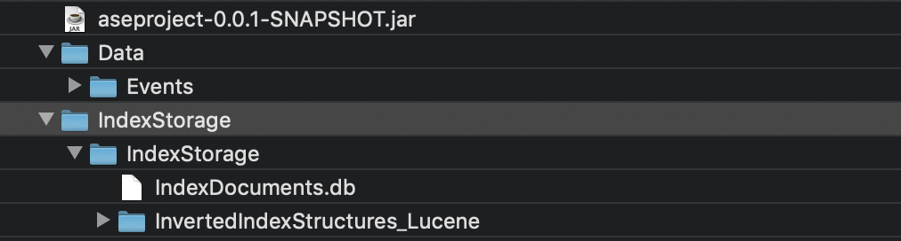
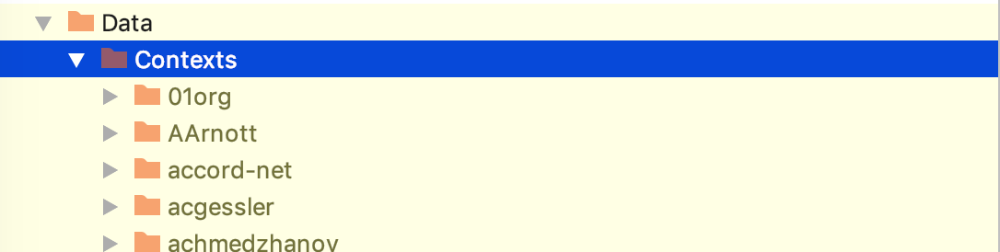

# Advanced Software Engineering project
## Implementation of Identifier-Based context-Dependent API Method Recommendation system

### Project status:

### Description:
**Goal:** Reimplement the system described in the given paper using the KAVE CC datasets.

#### Paper abstract:  
Reuse recommendation systems support the developer by suggesting useful API methods, classes or code snippets based on code edited in the IDE. Existing systems based on structural information, such as type and method usage, are not effective in case of general purpose types such as String. To alleviate this, we propose a recommendation system based on identifiers that utilizes the developer’s intention embodied in names of variables, types and methods. We investigate the impact of several variation points of our recommendation algorithm and evaluate the approach for recommending methods from the Java and Eclipse APIs in 9 open source systems. Furthermore, we compare our recommendations to those of a structure-based recommendation system and describe a metric for predicting the expected precision of a recommendation. Our findings indicate that our approach performs significantly better than the structure-based approach.

**Keywords:** software reuse; recommendation system; identifier; data mining

### What did we use:
* Programming language: [JAVA 8](https://www.java.com/en/)
* Framework: [SPRING BOOT](https://spring.io/projects/spring-boot)
* Framework: [MAVEN 3](https://maven.apache.org/)
* Datasets: [KAVE CC](http://kave.cc/)
* CI: [TRAVIS CI](https://travis-ci.org)
* Test Coverage: [Coveralls](https://coveralls.io)

### Installation 

First you need to get the contexts and events, the ones the app is testet with are:

**Contexts dataset:**

http://www.st.informatik.tu-darmstadt.de/artifacts/kave/Contexts-170503.zip

**events dataset:**

http://www.st.informatik.tu-darmstadt.de/artifacts/kave/events-170301-2.zip

Both of them are taken via the original source: http://www.kave.cc/datasets

**Additional info:**

  * **Contexts version:** May 3, 2017

  * **events version:** Jan 18, 2018

### Step by step guide 

#### Step 1 - Preparation: 

The first step you need to do is to download the sources. You either download a preindexed databases or you start from scratch.
Both ways will be described now. The goal is to reach a datastructure that looks like this:

##### Step 1.x - Quick Start:

If you have not enough time to put everything together and you are fine with the event and context version from above, there is a preconfigured zip to download which has everything nicely combined.
It can be found under: xxxx

If it does not work, please reach out to @dpinezich.

##### Step 1.1a - Contexts, preindexed Database:

Download the preindexed databases from:  https://gofile.io/?c=akdj6u

If it does not work, please reach out to @dpinezich.

##### Step 1.1b - Contexts, from scratch:

If you like to create your own settings just download the contexts from KAVE (http://www.kave.cc/datasets)
as described. This is also the preferred way if you want to update the contexts. It should look like this:

 
 
 This is to be understand additive to the first Image where Data only contains Events.

##### Step 1.2 - Events:

The events can easily be downloaded from the KAVE datasets ((http://www.kave.cc/datasets))

##### Step 1.3 - Jar-file:

You can get the Jar-file directly from GitHub in the mvn-repo branch: https://github.com/Amos94/ASE/tree/mvn-repo

##### Step 1.4 - Finalization:

If everything is put together according to the presented image the program can be run, either indexing the whole table or directly run the evaluation.

##### Step 2 - Run configuration:

The presented Jar contains 5 Paramters which can be set at the beginning:

The first parameter is: remove stopwords (bool)   
The second parameter is: reindex the database (bool)  
The third parameter is: do the evaluation (bool)  
The fourth parameter is: the last n considered statements for the lookback (int)  
The fifth parameter is: set number of recommendation zips (int) 

There are three possible configurations:
* no parameters
* the first three parameters set
* all parameters set

Therefore an example run, without indexing would look like this:  
`java -jar aseproject-0.0.1-SNAPSHOT.jar false false true 3 -1`

Which would then not reindex the database, not remove the stopwords (since no reindexing not needed anyway) but would do the evaluation with a loopback of 3 and all available recommendation zips.  

For further documentation on how to run the jar, please consider the [full documentation](../blob/master/docs/README.md).

### License

This project is to be known under Apache v2 license. Full license information can be found [here](../blob/master/LICENSE).
