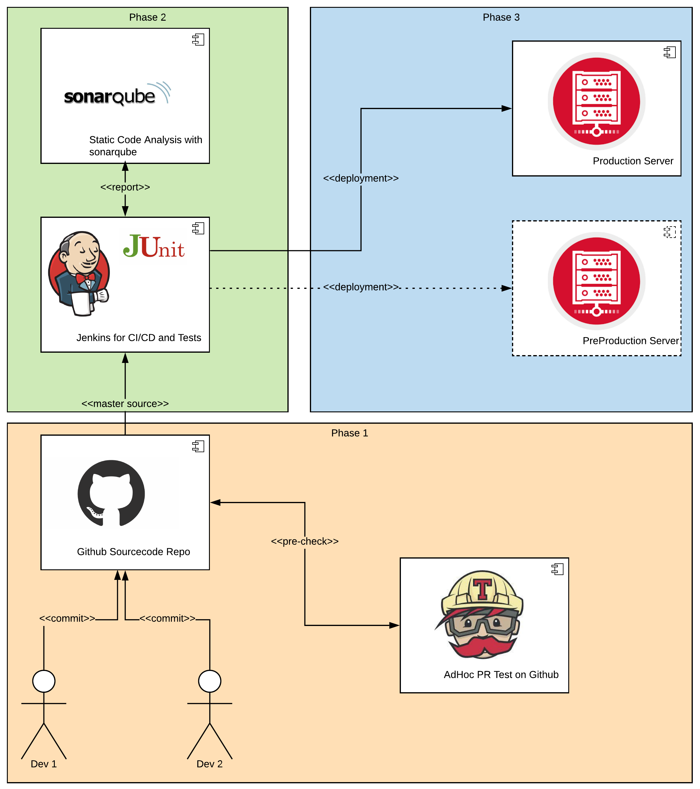
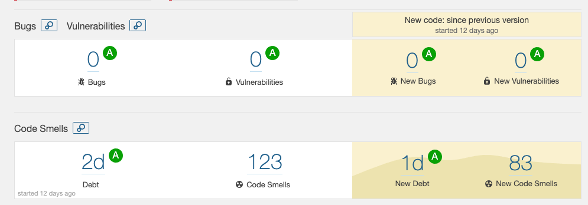
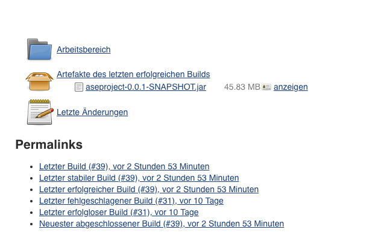
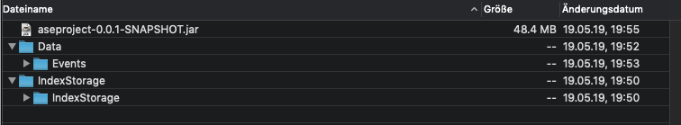
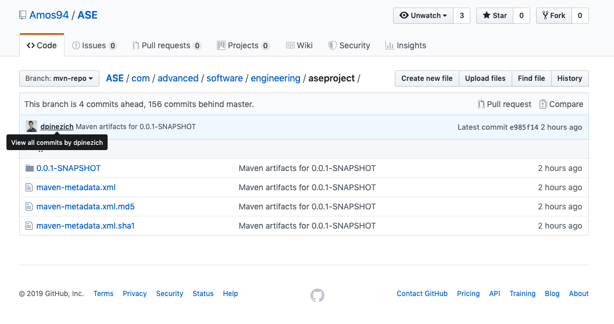

# Cookbook / Documentation
#### Implementation of Identifier-Based context-Dependent API Method Recommendation system

## 1. Introduction

This project was started as part of the Advanced Software Engineering, Spring 2019 course at the University of Zurich. The Goal was to Reimplement the system described in the given paper using the KAVE CC datasets. While our selected paper was “Implementation of Identifier-Based context-Dependent API Method Recommendation system” we tried to find smart ways to use this context-dependent API with the KAVE data. In the following chapters the reader will find an overview of all important parts which help to understand our approach and how to use and extend the project. It also should briefly introduce how we worked and how our environment was looking while doing the project.

## 2. Technical Description

In order to replicate the recommender system described in the paper, the development approach was straight forward. After getting used to the Contexts and Events datasets provided by KAVE we decided to start build the visitors. It might not be a surprise that the most used pattern it the project was the visitor pattern. We used it to traverse the syntax trees and retrieve the relevant information needed to create and query the index. The next step was to design and implement the data model of the index. In the end we implemented two versions for querying and evaluate it.

In the beginning, we thought it would be great to imply a test-driven development methodology, but it was a bit of an overhead given that we didn’t know how to interact with KAVE properly. However, we tested the most critical paths of our application and the Jaccard calculation.

Although we have taken extensive care to have implemented just clean code, in later stages, the project needed some deep refactoring. We had to remove code duplication and started to generalize the concepts a bit. Furthermore, we removed the smells and the bugs indicated by our static analysis tool as they were found. In order to keep the code clean and under control, we employed a PR driven methodology (details in the CI/CD section), where at least another peer had to review and approve/ reject the branch before merging master. Hence, we did not have any major problems, we assured that the tests were building and the test coverage increases or stagnates.

We tried to extend the project as much as we could. For example, even if in the paper the similarity measure used to evaluate each recommendation was the Jaccard similarity measure, we also implemented other similarity measurements, such as  Cosine similarity or the Euclidean Distance, so they can be used in later stages in our evaluation or future releases.

Among libraries, we used it some of them worth to be mentioned, e.g., the **Apache Lucene** which also provided the Potter stemmer out of the box or **Simmetrics** which provided a variety of similarity measures ready to use. We used JUnit and Mockito to ease our testing efforts.

In our development we used: Java 8, Spring Boot and MAVEN. As a database solution we chose SQLite because it’s lightweight, but powerful enough to store the index and query it.

For a detailed architectural view, please follow the links below where you can find the UML diagrams of the project packages.

Description | Image Link
------------ | -------------
Top-Level package | [High-Res Link](images/top_level_package.png)
Package aseproject | [High-Res Link](images/package_aseproject.png)
Package context | [High-Res Link](images/package_context.png)
Package events | [High-Res Link](images/package_events.png)
Package index | [High-Res Link](images/package_index.png)
Package similarity_measures | [High-Res Link](images/package_similarity_measures.png)
Package visitors | [High-Res Link](images/package_visitors.png)
Package utils | [High-Res Link](images/package_utils.png)
Project dependecies | [High-Res Link](images/mdl-aseproject.png)

For insights in the several classes we programmed, please have a look at the provided javadoc. We tried to add Javadoc to each class and method to make it easier to understand for the reader but not over-exceeding this documentation.

## 3. DevOps, CI/CD

The CI/CD management had one big challenge to face - the large amount of data used to create the index. We first tried to incorporate the whole index (or its basic contexts) as part of the git repository. This failed by the limitation of 100mb per repo. We then tried to use it as an independent jar, this works but the creation of the jar is slow and each time we want to use a different index we have to change this large jar. Because of these circumstances, we decided to be a bit more creative and use the techniques learned during the course. Therefore we separated our process into 3 phases which are now discussed in detail and illustrated as follows:



Phase 1:

During the first phase, we are focused on the code which needs to be runnable and the tests need to have no errors. Since we use GitHub as a source code repository we added Travis CI and coveralls just for the sole purpose to do this on each push. We also agreed to not push on the master branch during the project (and set the Github settings accordingly), this helped us to keep the quality in a good state at all times. The first phase ends when Travis has done its basic work and has the tests run. If this is completed and the code is reviewed by a peer, the PR (Pull Request) is ready to be merged to master (master branch).

Phase 2: 

In Phase 2 there is a Jenkins instance configured (VM, basic Ubuntu 18.04, not as a docker container). That is connected with the git repository via ssh keys. Jenkins checks every 5 minutes if there is something new on the master branch. If this is the case, Jenkins pulls the new code and starts a “clean package” maven command on the local runner. If this succeeds, a sonarqube instance (docker container, same VM as Jenkins) is called to visualize the jacoco report (note: the jacoco report can also be used for this locally if the maven command “clean test” is run).




Now we have a clear view of how the state of the code looks like. We were pretty picky about the Bugs and Vulnerabilites and therefore tried to keep the A-Level at all times. 

Phase 3: 

For the final step, Jenkins produces the jar file and stores it to the Jenkins local artifact storage as seen here:



but this is not yet enough for us, we also wanted to have a runnable, preconfigured version on the server. That is why we configured some more Shell-Scripts to move the newly created jar file in the right surrounding. As we can see there is the jar file and also preconfigured a folder with Events (if needed) and an IndexStorage.



This way, it was easier to do the experiments and evaluation, since we only had to replace the index storage if we wanted to for example test with a look back of 3, 4 or 5 and with or without stopwords. In our test environment, we only configured one such test server “prod” but it would be easy to add multiple instances (VMs, Docker Images) to have instances run in parallel for a larger experiment. 

Maven Repository on Github: 

Since we have way more jar files created than we are proud of, we added: “mvn clean target” as a manual step. If this is run, the settings preconfigured in pom.xml are activated and matched with the user's local m2 settings for GitHub (this needs to be done before the target command is executed). After some more seconds we have a brand new artifact on GitHub as seen here:



But keep in mind, this is only a running jar file. It needs the right environment either of a context folder filled with zips or with a preconfigured IndexStorage Database. 


## 4. Configuration

To make the program as versatile and easy to use when deployed as a jar we added a number of configuration variables. Some of them need to be set directly in Configuration.java (the ones in our opinion are seldom changed) and ones which can directly be implemented while calling java -jar. Here is a list of all settings which concludes what they do and how they can be changed:

Name | Default | Purpose | Accessor
------------ | ------------- | ------------ | -------------
EVENTS_DIR | Data/events | Folder for all event zips | Needs to be changed in the file
CONTEXTS_DIR | Data/Contexts | Folder for all context zips | Needs to be changed in the file
INDEX_STORAGE | IndexStorage | The location where the created index should be stored | Needs to be changed in the file
MAX_CANDIDATES | 10 | Maximum number of candidates  | Needs to be changed in the file
STOP_WORDS | default list | List of stop words that can be removed | Needs to be changed in the file
RECOMMENDATION_ZIPS | -1 | How many projects (zips) should be taken into account (-1 = all in the case there are more than 1 zips in the directory), recommended to test against 1 project at time.  | Can be set initially
REMOVE_STOP_WORDS | true | Should the stop words be removed or not | Can be set initially
REINDEX_DATABASE | false | Should the database be reindexed (only needed in the first run, or when a new setting is evaluated) | Can be set initially
EVALUATION | true | Should there be an evaluation of the events? => often used if you only want to reindex the db for experiments | Can be set initially
LAST_N_CONSIDERED_STATEMENTS | 3 | How big is the lookback set? | Can be set initially
USE_EVENTS | false | Use events against the whole indexed database for recommendations | Needs to be changed in the file
USE_TEST_CONTEXTS | true | Use contexts and query against the filtered by project indexes for recommendations => as described in the paper | Needs to be changed in the file
DELIMITER | ** | Set an individual delimiter for messages | Needs to be changed in the file

This table concludes into 3 flavors of calling the jar and make it configurable, this is in detail described now:

*Minconfig*

This can simply be called by: ```java -jar aseproject-0.0.1-SNAPSHOT.jar```

*Mediumconfig*

This can be called with three additional parameters: ```java -jar aseproject-0.0.1-SNAPSHOT.jar false true false```

The first parameter is: remove stopwords (bool)
The second parameter is: reindex the database (bool)
The third parameter is: do the evaluation (bool)

*Maximumconfig*

The last configuration has the most parameters and extends the mediumconfig: ```java -jar aseproject-0.0.1-SNAPSHOT.jar false true false 6 1```

The first parameter is: remove stopwords (bool)
The second parameter is: reindex the database (bool)
The third parameter is: do the evaluation (bool)
The fourth parameter is: the last n considered statements for the lookback (int)
The fifth parameter is: set number of recommendation zips (int) 

## 5. Evaluation
For evaluation we took at random 20 projects and evaluate them against different paramenters with appropriate databases created.

| #  | Project Name     |  Recommendation Rate % (Lookback: 3, Remove Stop Words: false) |  Recommendation Rate % (Lookback: 3, Remove Stop Words: true) |  Recommendation Rate % (Lookback: 4, Remove Stop Words: false) |  Recommendation Rate % (Lookback: 4, Remove Stop Words: true) |  Recommendation Rate % (Lookback: 5, Remove Stop Words: false) |  Recommendation Rate % (Lookback: 5, Remove Stop Words: true) |
|----|------------------|----------------------------------------------------------------|---------------------------------------------------------------|----------------------------------------------------------------|---------------------------------------------------------------|----------------------------------------------------------------|---------------------------------------------------------------|
|  1 | 01org            | 35.1791                                                        | 33.9869                                                       | 43.1818                                                        | 42.9967                                                       | 44.4805                                                        | 43.2198                                                       |
| 2  | filipw           | 57.1428                                                        | 42.857                                                        | 50                                                             | 100                                                           | 100                                                            | 100                                                           |
| 3  | GuillaumeGuerra  | 53.3333                                                        | 50                                                            | 60                                                             | 58.3333                                                       | 58.3333                                                        | 58.3333                                                       |
| 4  | imazen           | 0                                                              | 0                                                             | 0                                                              | 27.2727                                                       | 27.2727                                                        | 27.2727                                                       |
| 5  | karno            | 30.1369                                                        | 26.0273                                                       | 30.1369                                                        | 27.3972                                                       | 30.8219                                                        | 27.4180                                                       |
| 6  | Kinect           | 40.0                                                           | 40.0                                                          | 38                                                             | 38                                                            | 50                                                             | 50                                                            |
| 7  | MediaPortal      | 36.4341                                                        | 37.2093                                                       | 26.3565                                                        | 25.5813                                                       | 26.3565                                                        | 25.5813                                                       |
| 8  | nodatime         | 33.3333                                                        | 33.3333                                                       | 55.5555                                                        | 55.5555                                                       | 44.4444                                                        | 44.4444                                                       |
| 9  | OctopusDeploy    | 58.3333                                                        | 50                                                            | 58.3333                                                        | 58.3333                                                       | 75                                                             | 69.2572                                                       |
| 10 | opserver         | 41.0138                                                        | 35.0230                                                       | 43.7788                                                        | 41.0138                                                       | 45.1612                                                        | 43.5350                                                       |
| 11 | petabridge       | 46.6666                                                        | 46.6666                                                       | 56.6666                                                        | 100                                                           | 100                                                            | 100                                                           |
| 12 | PistonDevelopers | 50.4854                                                        | 51.4563                                                       | 53.8461                                                        | 52.8846                                                       | 58.6538                                                        | 56.1944                                                       |
| 13 | ravendb          | 19.4915                                                        | 21.6101                                                       | 19.4915                                                        | 100                                                           | 100                                                            | 100                                                           |
| 14 | RehanSaeed       | 49.4736                                                        | 61.2903                                                       | 53.6842                                                        | 62.3655                                                       | 55.7894                                                        | 49.6390                                                       |
| 15 | rodpdev          | 100                                                            | 100                                                           | 100                                                            | 100                                                           | 100                                                            | 100                                                           |
| 16 | roederf          | 36.3636                                                        | 36.3636                                                       | 40.9090                                                        | 40.9090                                                       | 40.9090                                                        | 40.9090                                                       |
| 17 | spring-projects  | 14.3815                                                        | 15.7184                                                       | 22.6270                                                        | 70                                                            | 80                                                             | 80                                                            |
| 18 | TestStack        | 59.4795                                                        | 48.6988                                                       | 62.0817                                                        | 54.6468                                                       | 63.1970                                                        | 55.5353                                                       |
| 19 | toggl            | 84.6153                                                        | 76.9230                                                       | 84.6153                                                        | 49.0196                                                       | 60.3773                                                        | 46.3548                                                       |
| 20 | vinukj           | 46.9387                                                        | 45.8333                                                       | 55.1020                                                        | 56.25                                                         | 59.1836                                                        | 60                                                            |

## 6. Overheads and adaption

### A conceptual problem
The recommender system described in the paper is creating an index to which associates each method call to the its context given a predefined lookback. Then, the recommender is querying the index to retrieve the recommendation set. 

In the specifications given it is stated that we shall build a model from the contexts given and test it against the events. Hence, here we encounter our first conceptual problem, where we tried to link the projects indexed from the contexts to the ones that exist in events. It was impossible. Therefore, we decided to have two versions that can be easily interchanged. 

In the first version, we index the contexts and also use contexts to query the database, where the query filters the the entries stored by the project name. In this case, the results were very close to the one reported in the given paper.

The second version, uses the events to query the stored index (made from contexts), but we do not filter for anything, hence the recommendation rate is considerably smaller than the recommendation rate in the first version since it is impossible to map the project names between the two datasets and we need to query the whole database and retrieve the recommendation sets.

### Getting used with KAVE CC
Nobody can argue the quality of KAVE. The datasets can be easily used for research by familiarized users. The examples provided in the project’s GitHub are very useful for novice users and they provide a very good starting base. However, the lack of documentation was felt in the later stages of the project when we weren’t sure what is there or not. Nonetheless, it wasn’t a big blocker since the development process got easier with time. 

## 7. Reccomendations

### How to use the Recommender
In our opinion the best and the most efficient way to use the recommender is the way described in the paper:
* We already have indexed the contexts for a predefined lookback of 3,4 and 5 for both cases: including and excluding the stopwords
* Add in the Contexts folder a project folder with a zip, i.e. the methods that you want to test. Our recommender will give you a recommendation set for each method found in the SST found in that project.
* Make sure you make the the relevant changes for the case you want to test, e.g., REINDEX_DATABASE = false, EVALUATION = true, lookback should have the same number as the one that was used to index the db, REMOVE_STOPWORDS should have the same value as the one it was used to index the db (due to we have to treat the query in the same way we treated the index at its creation).

You can test against one or more contexts, just make sure you change the RECOMMENDATION_ZIPS value (See Configuration for more information). Furthermore, feel free to change the MAX_CANDIDATES value. In our tests we used a set of 10 methods per recommendation set. It is important to state that the paper does not specify anything about the recommendation set size.

One can also test it against the events. Make sure you take care of the last point above and set the proper configuration. Just add a folder which contains a zip with some events in Events directory. Make sure you will be patient because for each method we need to query the whole database to retrieve the relevant info since it’s impossible to map a project from Contexts to a project from Events. The recommendation rate will be smaller, but at least it’s an interesting exercise to see how powerful is this recommender with unknown contexts.

## 7. Conclusion

It took quite some time to understand the paper that we selected. Since the authors reimplemented an approach that was already done as a reimplementation of a former tool “Rascal” (F. Mccarey, M. Cinnéide, and N. Kushmerick, "Rascal: A recommender agent for agile reuse," Artificial Intelligence Review, vol. 24, pp. 253-276, 2005.) the information was even more dense. We also had the impression that the authors were only partwise happy with the results of their study because they described their approach not as detailed as it could be. The results were also not extremly high with around 40%. We could achieve the same result with the KAVE set, and sometimes even better results on certain random picked projects. We are pretty happy with our results. It was also amazing to see, that not everytime more lookback is just better - if we look at kinect we already had pretty good results with a lookback of 3 but we had a clear loss in a lookback of 4 but then it went up again when we tried the loopback of 5. We also saw, that stopwords can halp quite a bit, for example in OctopusDeploy were we managed almost 7% by setting stopwords on and off in the loopback of 5. 

What made us happy was not only that we reimplemented the approach of the paper succesfully. We also had the chance to try out several things for our further software engineering career. Beginning with heavy use of all features which are offered by Github. Even more, we combined coveralls and Travis to see how they can help directly out of the box. Furthermore to see how pleasant it is to have a CI/CD Pipeline fully under control and as being able to manipulate huge amounts of data. We also saw that sonarqube helps to find bugs or code smells. In particular, it was even more awesome to see that already memorized patterns are challenged and resources to better practices are directly offered. This way, some of us had some “AHA” moments while revising certain code pieces. Last but not least the heavy use of a pattern none of us had used so far, the visitor pattern, which is now the core of this project.

After all, one can say that doing this project was not easy but with all the practices learned during the courses we were able to try out most of them on a real example. For future projects, we now have more experience which tools to apply in certain situations and which we might not apply anymore, same holds for patterns. Knowing “your” tools is a strong skill of each and every software developer and should not be underestimated.

To conclude in a funny manner, a quote that I like and I relate with when I jump in a new project and I have to interact with new things is: "A fool with a tool, it's still a fool". :)
